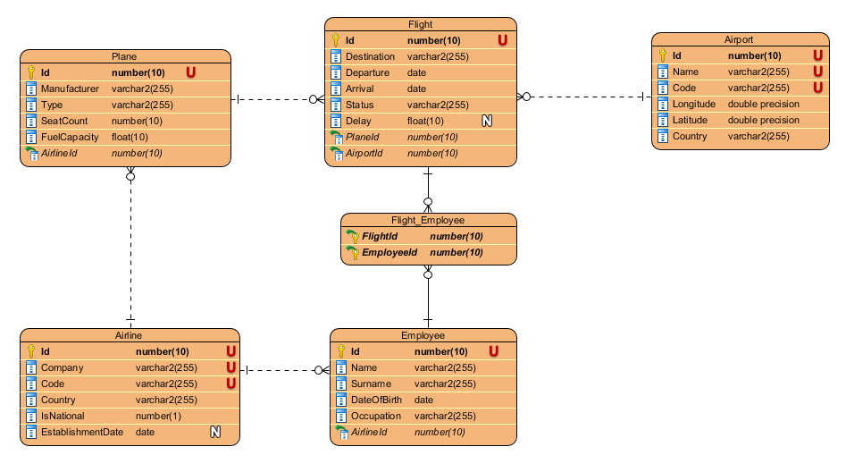

# oracle-pup

With sample database schema (and fake data) we explore Oracle 19c capabilities.

## Testing environment (stage 1)

### Data model

[See documentation (1A)](./doc/1A.pdf)

### Fake data and performance

[See documentation (1B)](./doc/1B.pdf)

In 6 tables we have about 2.25 MB of data (35k rows total).

With 3 query sets (5 queries each) the longest one takes 3.32s (in Oracle SQL Developer VM image with 2GB RAM and 4 cores).

## Active rules (stage 2)

### ECA model

[See documentation (2A)](./doc/2A.pdf)

Event (i) - Condition (i, ii) - Action (ii)

5 rules have been proposed along with:
- rule description
- initiating events
- conditions
- action
- action complexity estimation

### Performance tests and experiments

[See documentation (2B)](./doc/2B.pdf)

- with active rules the query sets took longer time
- experiment 1: the maximum number of calls in the Oracle database is 50
- experiment 2: the Oracle database does not ensure the order in which the rules are executed

## Semistructural data (stage 3)

### XML extensions

[See documentation (3A)](./doc/3A.pdf)

The initial schema is extended by 3 XML modifications.
3 query sets were changed accordingly to fit the new schema.

### Performance tests

[See documentation (3B)](./doc/3B.pdf)

Times for XML were significantly lower.

## Spatial data (stage 4)

### Spatial extensions

[See documentation (4A)](./doc/4A.pdf)

4 exentions on initial schema were made by changing some columns to geometrical shapes like a point, a line or a multiline. 3 query sets were changed accordingly.

### Performance tests and experiments

[See documentation (4B)](./doc/4B.pdf)

Tests were made for spatial data indexed and with no index. In almost each case the times are much lower than operations on non-indexed data.

## Column store (stage 5)

### Spatial extensions

[See documentation (5A)](./doc/5A.pdf)

3 extension (changing a whole table to in-memory storage) were made on initial schema.

### Performance tests and experiments

[See documentation (5B)](./doc/5B.pdf)

Unfortunately the results are not reliable due to incorrect memory cofiguration on VM.

- all average times were significantly higher for column store

- experiment 1: for non-modifying (select) operations, query execution times have slightly improved for column store

- experiment 2: regardless of the type of compression selected (query low/high, capacity low/high), the size of the table was identical
